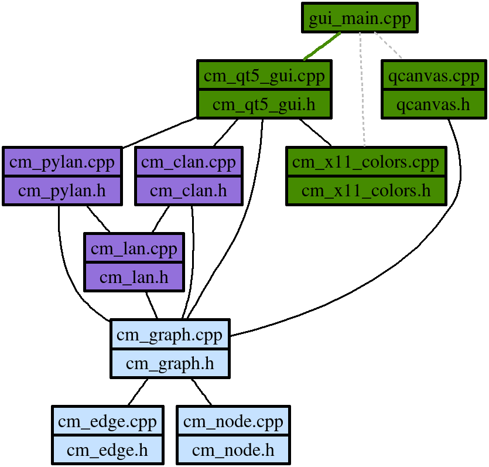

<a href="https://en.wikipedia.org/wiki/The_C_Programming_Language"></a>
<a href="https://nerdinmadrid.tumblr.com/post/667400970801692672/free-software-for-video-editing-get-your-last"></a>
<a href="https://graphviz.org/docs/library/"></a>


# Code Mapper

Code Mapper is a set of tools to generate standard ```graphviz``` graphs from source code. Play with ```codemapper``` learning ```Graphviz```.

This project is starting and it still is in progress, please join us to work together and start with the: [TO-DO](doc/TODO.md) list.


## Download and compile

The ```codemapper``` tools are written in C++ language:

```
$ git clone git@github.com:armengot/codemapper.git
$ cd codemapper
$ mkdir build
$ cmake ..
$ make
```

## Requirements

Code Mapper sources must link with ```graphviz``` as a library, so first to compile  ```codemapper``` sources your system must find ```graphviz``` sources. The codemapper (```cmgui```) GUI binary requires **[Qt5 libraries](https://wiki.qt.io/Install_Qt_5_on_Ubuntu)**.

```
$ git clone https://gitlab.com/graphviz/graphviz
$ cd graphviz
$ mkdir build
$ cmake ..
$ make
$ make install
```

To complete this previous step, may be other packages could be required, as ```bison``` or ```flex```, etc. **Please** if **you** uses **Windows**, **go to [details](doc/winsetup.md)** to more info about requirements.
```
$ sudo apt-get install bison
$ sudo apt-get install flex
```
To learn more about ```graphviz``` software and library bindings review the **[library documents](https://www.graphviz.org/pdf/libguide.pdf)**, **[graph documents](https://www.graphviz.org/pdf/libguide.pdf)** or many other ```graphviz``` **[documents](https://www.graphviz.org/documentation/)**.

## Codemapper as separated graph library

Inside ```lib``` folder the codemapper own graph lib is availble. To be used a ```cm_graph``` the ```exe/testlib.cpp``` is available to be executed as ```testlib``` binary.
```
    /* nodes and edges */    
    cm_node cm_exe("exe","exe/main.cpp");
    cm_node cm_gui("gui","gui/main.cpp");    
    cm_node cm_lib("lib","{lib/*|class node\\nclass edge\\nclass graph}");
    cm_lib.add_feature("shape = record");
    cm_node cm_lan("lan","{lan/*|source language}");
    cm_lan.add_feature("shape = record");
    cm_node qt_lib("qt","Qt5");
    qt_lib.add_feature("shape = box");
    qt_lib.add_feature("style = filled");
    qt_lib.add_feature("fillcolor = lightgray");    
    cm_node grphvz("graphviz","graphviz");
    grphvz.add_feature("style = filled");
    grphvz.add_feature("fillcolor = lightgray");
    cm_edge dep1("","",&cm_exe,&cm_lib);
    cm_edge dep2("","",&cm_gui,&cm_lib);
    cm_edge dep3("","",&cm_exe,&cm_lan);
    cm_edge dep4("","",&cm_gui,&cm_lan);
    cm_edge dep5("","",&cm_gui,&qt_lib);
    cm_edge dep6("","",&cm_exe,&grphvz);
    cm_edge dep7("","",&cm_gui,&grphvz);    
    
    /* graph building */
    cm_graph test("codemapper");
    test.addnode(&cm_exe);
    test.addnode(&cm_gui);
    test.addnode(&cm_lib);
    test.addnode(&cm_lan);
    test.addnode(&qt_lib);
    test.addnode(&grphvz);
    test.addedge(&dep1);
    test.addedge(&dep2);
    test.addedge(&dep3);
    test.addedge(&dep4);
    test.addedge(&dep5);
    test.addedge(&dep6);
    test.addedge(&dep7);
    test.edgesall("arrowhead = none");

    /* output */
    std::cout << test.to_string() << std::endl;
```
## Codemapper as command line app

Finnaly compiled, ```codemapper```can be called from the prompt as shown in the following examples:

### Example (1):
```
codemapper/build$ ./test | ./simple > basic.png
```


### Example (2):
Current status of this project: Can ```codemapper``` parse itself?
```
$ ./codemapper -t /home/marcelo/dev/personal/github/codemapper/ -l cpp -o png > codemapper.png
$ ./codemapper -t /home/marcelo/dev/personal/github/codemapper/ -l cpp -o svg > codemapper.svg
$ ./codemapper -t /home/marcelo/dev/personal/github/codemapper/ -l cpp -o dot > codemapper.dot
```
