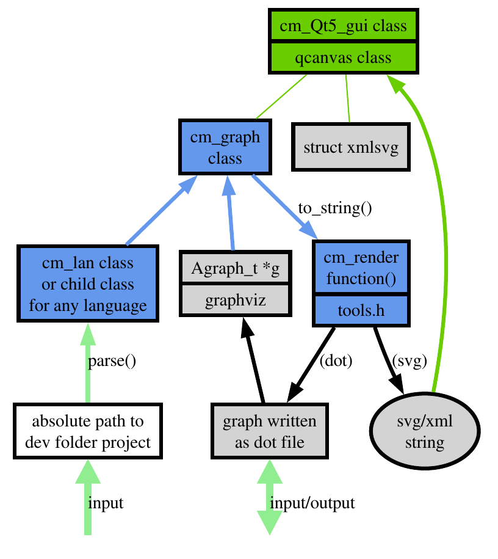

<a href="https://en.wikipedia.org/wiki/The_C_Programming_Language"></a>
<a href="https://nerdinmadrid.tumblr.com/post/667400970801692672/free-software-for-video-editing-get-your-last"></a>
<a href="https://graphviz.org/docs/library/"></a>

# Code Mapper documentation (for devs)

The ```codemapper``` tools have been developed with a triple objective: 


- [x] 🔭 (1) on one hand, out of necessity, to provide tools for automated visual analysis of software; 
- [x] 🐧 (2) on the other hand, to demonstrate to ourselves how a project in C++ can be developed with a graphical environment (Qt5) and linked to both external and our own libraries; 
- [ ] 🎓 (3) simultaneously addressing what the projects we will analyze through the codemapper tools did not do, which is to draw design diagrams as we were taught in university.

So, the third goal of the previous list, is the target of next sections.

## Classes diagram

When working on a C++ project where some classes are instantiated and we create different executables that use common source code, it's important to have an overview of the classes that will be designed and how they interrelate.

The following diagram illustrates the state of the classes design in the early phases of the project. It was first published in version DEV_00_04.01 and pays special attention to the Qt5 classes for building the graphical interface, whose options are progressing as we view the project as their first users.


To generate the diagram, the ```graphviz``` tools were used, parsing the ```classes.dot``` file (available in the same folder where you are reading this words) as follows:

```
$ dot -Tpng classes.dot > classes.png
$ dot  -Tps classes.dot > classes.ps
```
Yo can download for printing, or learn how do the same with your project, with a LaTeX code like this (I called ```print_classes.tex```):
```
\documentclass[a4paper]{article}
\usepackage{graphicx}
\usepackage{geometry}
\geometry{margin=0pt}
\begin{document}
\begin{figure}[p]
    \centering
    \includegraphics[width=\paperwidth,height=\paperheight,keepaspectratio]{classes.ps}
\end{figure}
\end{document}
```
So, to generate the ```classes.pdf``` file  I did:
```
$ latex print_classes.tex
$ dvips print_classes.dvi
$ ps2pdf print_classes.ps
```

## Flow diagram

The data flow in the codemapper GUI can be somewhat obscured by the set of classes and functions (internal and external) involved.



In the following diagram, we can see more clearly that:
- There are only two ways to input data, either through an absolute path to a system folder where there is code to process, or as a dot file, which is also a possibility to save work after processing the graph.
- On the other hand, the cm_graph class directly uses the data structures of Graphviz in one of its constructors, to accept a Graphviz graph as input data.
- Finally, the graphical representation in Qt5 is resolved through SVG, the cm_render function within tools.h allows going from data input to graphical output (in both directions) using also the available Graphviz functions.

## First auto example

Loading with ```cmgui``` tool its own source code with folder option, I removed some nodes and played with colors and sizes. The result is an interesting and auto explicit file deps diagram so near than previous flow diagram. You can finish your graphs editing the .dot file.


